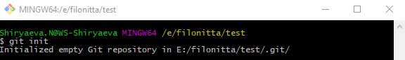
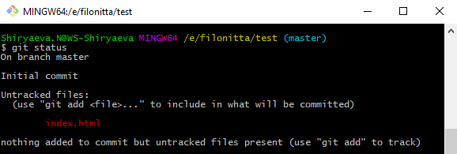
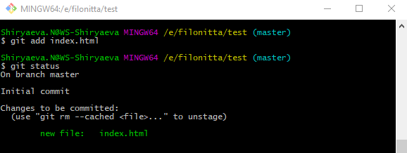
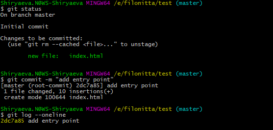

# Version Control System (VCS)
## Git

### История

До появления Git и подобных систем (TFS, SVN, ...) разработка, обмен и слияние элементов проекта осуществлялись вручную, что создавало массу сложностей и занимало много времени

С развитием технологий встал вопрос создания системы контроля версий, которая позволила бы вести командную разработку более эффективно

Автором распреденной системы контроля версий Git является *Линус Толвальдс*, создатель ОС Linux

Git появился на свет в 2005 году

### Определение
**Git** - *распределенная система контроля версий*, что позволяет разработчикам работать только со своей локальной копией проекта, хранящей всю историю разработки проекта

Система позволяет команде эффективно и асинхронно добавлять и изменять код в одном и том же проекте, предоставляет механизмы для отмены изменений, просмотра истории, создания ветвей, решения конфликтов и др.

* **Хранилище истории разработки:** возможность получить любую из сохраненных версий проекта целиком либо версию конкретного файла
* **Инструмент командной работы:** параллельное выполнение задач, интеграция изменений с автоматическим обнаружением конфликтов
* **Бэкап проекта:** сохранение рабочей версии проекта на удаленном сервере

### Установка
##### Windows
Для установки Git под Windows необходимо [скачать дистрибутив](https://git-scm.com/download/win) и следовать инструкциям в Setup окне. Настройки лучше оставить по умолчанию

После успешного завершения установки у вас появится bash-терминал и дополнительные пункты контекстного меню в проводнике

##### Linux
Для установки Git на Linux OS нужно выполнить команду `apt-get install git`

##### Mac OS
Для установки Git на Linux OS нужно выполнить команду `brew install git`

По завершению, команда `git --version` покажет версию установленного дистрибутива, что есть индикатором успешного завершения установки

### Настройки
После установки гита необходимо его сконфигурировать: каждое внесенное изменение должно иметь автора, поэтому прежде всего необходимо его указать:
```console
git config --global user.name "Your Name"
git config --global user.email "youremail@domain.com"
```

Команда `git config --list` отобразит текущие настройки конфигурации

### Основные возможности
##### git init
Команда `git init` воздает пустой локальный репозиторий в текущем каталоге

После инициализации репозитория в корне проекта появится папка **.git**, которая будет содержать конфигурацию и всю историю изменений проекта



| Рабочая директория | Индекс (changes) | Репозиторий (full history) |
| ----------- | ----------- | ----------- |
| Список рабочих файлов | Список файлов рабочей директории, отслеживаемых системой git ||
| `index.html` | `index.html` | `index.html`       |

#### git status
Команда `git status` показывает текущие изменения проекта, которые должны быть *сохранены* или *проигнорированы*



#### git add
Команда `git add` добавляет одно/несколько/все изменения в индекс (трекер)

**Варианты использования:**
```git add file1.txt``` - добавляет в индекс один конкретный файл
```git add file1.txt file2.txt``` - добавляет в индекс несколько файлов
```git add *.txt``` - добавляет в индекс все файлы с расширением .txt
```git add .``` - добавляет в индекс все файлы



#### git commit
Команда `git commit` записывает изменения в локальный репозиторий, то есть создает новый коммит с текущим содержимым индекса и заданным описанием

```console
git status
git commit -m "add entry point"
git log --oneline
```


##### Хороший коммит
* Каждый коммит описывает одно *законченное* действие или промежуточное состояние фичи (atomic)
* Коммит должен быть логически завершенным изменением проекта (atomic consistent)
* Добавлять изменения в индекс (коммитить) нужно как можно чаще
* Текст сообщения должен быть минимально информативным

#### git push
Команда `git push` отправляет изменения, сохраненные в локальной базе данных, в удаленный репозиторий

Для этого удаленный репозиторий должен быть создан и проассоциирован с локальным

Размещать удаленный репозиторий можно на одной из существующих платформ: [GitLab](https://gitlab.com), [GitHub](https://github.com), [Bitbucket](https://bitbucket.org) и т.п.

```console
git remote add origin https://github.com/filonitta/test.git
git remote -v
git push -u origin master
```
Для того, чтобы изменить связь локального репозитория с remote-сервером, используется команда

```console
git remote set-url <new_address>
```
#### git pull
Команда `git pull` вытягивает изменения из удаленного репозитория в локальный

#### git clone
Команда `git clone <url>` скачивает удаленный репозиторий вместе с его историей в текущую папку

#### Вспомогательные команды
* **git log** - просмотр истории изменений
* **git diff *<name>*** - сравнение веток, рабочей директории или файла с его сохраненной локальной версией
* **git rm *<name>*** - удаление файла из индекса (но не физически)
* **git checkout *<hash>*** - переключение между коммитами или между ветками

#### Игнорирование
Не все файлы или папки являются частью проекта и должны быть сохранены в удаленном репозитории. Вспомогательные модули, каталоги IDE, файлы логов, иногда картинки - не следует сохранять в репозитории

Для того, чтобы сообщить гиту о том, что определнные файлы нужно игнорировать, их необходимо описать в специальном файле **.gitignore**, в корне проекта

##### Пример содержимого файла .gitignore

```javascript
.idea
data/models
error.log
log/**/*.*
# index.html
```

#### SSH
Отправляя данные из локального репозитория в удаленный (`push`), Git требует подтвердить авторизацию на удаленном ресурсе

Для того, чтобы раз и навсегда познакомить локальный и удаленный репозитории, необходимо создать и установить специальный ключ для доступа по SSH-протоколу (Security Shell))

Команда `ssh-keygen` создает уникальный идентификатор клиента

SSH-ключи представляют из себя пару "закрытый-открытый ключ". Закрытый должен храниться у клиента в защищенном доступе. Открытый - отправляется на сервер. Таким образом, при обращении с локального клиента к удаленному серверу происходит сверка приватного и публичного ключей, которые ассоциированы друг с другом

После генерации ключа необходимо скопировать его публичную (открытую) часть и разместить на удаленном Git-сервере: `cat ~/.ssh/id_rsa.pub`

#### Базовые команды терминала
* **ls** - (list) отображает список файлов и папок текущей директории. Модификаторы: `ls -l`, `ls -a`, `ls -la`
* **cd** - (change directory) осуществляет переход к указанной директории. Вариант `cd ~` - переход в домашний каталог, `cd -` - переход к предыдущему каталогу
* **mkdir** - (make directory) создает новый каталог с указанным именем `mkdir index`
* **touch** - создает новый файл с указанным именем `touch index.html`
* **cat** - отображает содержимое указанного файла: `cat index.html`
* **cp** - (copy) копирует указанные файл или папку в новую локацию `cp index.html ../main.html`
* **mv** - (move) перемещает указанные файл или папку в новую локацию. Если локация не меняется, то происходит переименование файла (или папки)
* **rm** - (remove) удаляет указанные файл или папку. Для удаления папок необходимо указывать модификатор `-r` для рекурсивного удаления подкаталогов

#### Полезные ссылки
1. [Список команд git](https://git-scm.com/docs)
2. [Быстрый старт](https://habr.com/ru/post/125799/)
3. [Pro Git Book ONLINE](https://git-scm.com/book/ru/v1)
4. [Try Git](https://try.github.io/)
5. [Git Branching](https://learngitbranching.js.org/)
6. [Команды Linux](https://losst.ru/42-komandy-linux-kotorye-vy-dolzhny-znat)