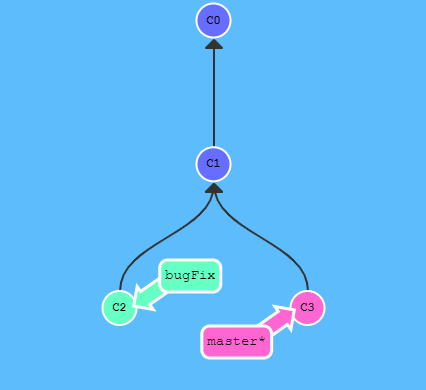
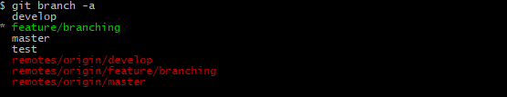
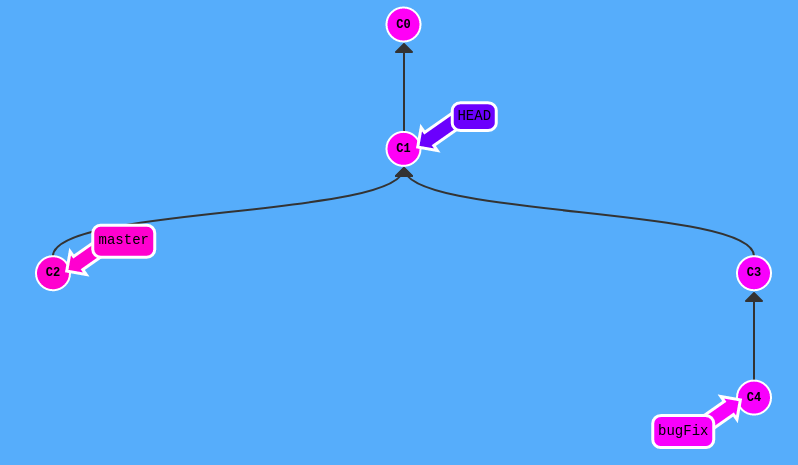
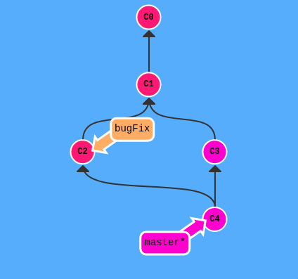
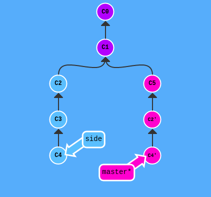

# Version Control System (VCS)
## Git

*Ветвление* – главная фича, делающая Git удобным инструментом для командной работы

Каждая ветка представляет собой отдельный поток разработки, в котором работа ведется изолированно от главного потока и всех побочных

История ветки - это последовательность ее коммитов

При первом коммите по умолчанию создается ветка _master_

Ветки в гите - это просто указатели на определенный коммит, который становится для них _родительским_

	

### git branch
Команда `git branch` показывает список локальных веток, с модификатором `-a` - список локальных и удаленных веток: `git branch -a`

	

`git branch <name>` позволяет создать новую ветку с указанным именем и вершиной в текущей ветке (родительский коммит)

#### Стратегии ветвления
* Подход к разработке **"тематические ветки"**: новые фичи реализуются в отдельных ветках и интегрируются в `master`, когда они готовы

* Стратегия **"релизные ветки"**: новые фичи реализуются в `master`, а для релиза создается отдельная ветка, где продолжается шлифовка тех фич, которые решено взять в релиз

* **Git Flow** - подход, предполагающий использование отдельной ветки с именем `develop` как основной ветки при разработке. Для каждой новой фичи ответвляются от `develop`, при окончании разработки фичи ее мержат обратно в `develop`. Ветка `master` хранит релизные версии проекта

Есть и другие стратегии, более популярные в узких кругах :)

### git checkout
Команда `git checkout <branch|hash>` позволяет переключиться на указанную ветку (или указанный коммит)

| _При переключении на конкретный коммит возникает специфическое состояние под названием "отделенный HEAD". Keep focused to not make a commit in this state_

	

`git checkout -b <branch_name>` - позволяет одновременно создать ветку и переключиться на нее

При попытке переключиться на другую ветку при несохраненных изменениях в текущей ветке (в проиндексированных файлах, различающихся на обеих ветках), Git выдаст сообщение об ошибке

Но есть варианты:
* `git checkout -f <branch_name>` - принудительное переключение на ветку с потерей незакоммиченных изменений
* `git stash` - эта команда собирает незакоммиченные изменения, удаляет их из файла и архивирует их в Git
* `git stash pop` - вернуть изменения из архива в файл (и очистить архив)

| _С помощью `git stash` можно переносить изменения из одной ветки в другую (watch out!)_

`git checkout <filename>` - отменяет изменения в указанном файле, то есть переключается на состояние файла до изменений в нем

### git reset
Иногда возникает необходимость откатить изменения в проекте, отменив коммит или удалив запись в индексе

Для этого Git предоставляет команду `reset` с такими опциями:
* `git reset --soft <hash>` - команда удаляет изменения из _базы_, но оставляет в _индексе_
* `git reset --mixed <hash>` - команда удаляет изменения из _базы_ и из _индекса_, но не из _рабочей директории_
* `git reset --hard <hash>` - команда удаляет изменения из _базы_, из _индекса_ и из _рабочей директории_

### git merge
Для объединения версий двух веток существует команда `git merge <source_branch>`. После выполнения команды история **текущей** ветки (_ours_) дополняется историей ветки **source_branch** (_theirs_)

#### Типы слияния
* Слияние перемоткой (Fast-forwarding): текущая ветка является прямым потомком _target_branch_ (или прямым родителем _source_branch_), по сути это простое передвижение коммитов целевой ветки на текущий `HEAD`
* Истинное слияние: изменения в каждом файле анализируются и объединяются в новый коммит (_коммит слияния_). При таком слиянии возможно появление конфликтных ситуаций (_прерванное слияние_)

	

#### Варианты слияния
* `git merge <source_branch> --no-commit` - выполняет слияние файлов, но не создает новый коммит автоматически. Полезно при семантических конфликтах
* `git merge <source_branch> --no-ff` - выполняет слияние файлов без перемотки, то есть создавая отдельный коммит слияния. Полезно для того, чтобы сохранить историю разработки в разных ветках
* `git merge <source_branch> --squash` - вливает изменения из _source_branch_ в текущую ветку одним коммитом, то есть без переноса истории ветки-источника

#### Отмена слияния
`git merge --abort` - отменяет режим слияния

`git reset --hard @~1` - откатит все изменения к предыдущему коммиту, то есть тому, который предшествовал слиянию

`git branch --no-merged` - показывает ветки, которые были влиты в текущую

#### Удаление веток
`git branch -d <branch_name>` - удаляет ветку с указанным именем, если она была объединена с текущей

`git branch -D <branch_name>` - удаляет ветку в любом случае

### git cherry-pick
Команда `git cherry-pick <hash>` позволяет "влить" в текущую ветку изменения, сохраненные в коммите _<hash>_, не объединяя при этом ветки (то есть просто скопировать коммит)

	

### Вспомогательные команды
`git diff <branch1> <branch2>` - сравнение веток _branch1_ и _branch2_

`git reflog` - позволяет посмотреть историю работы с веткой